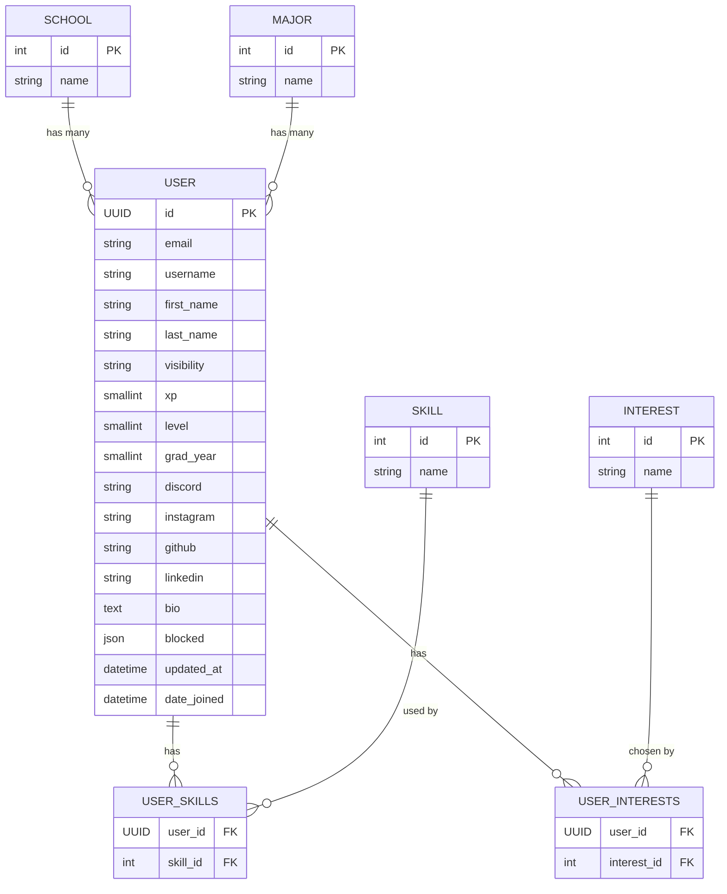

# Django + PostgreSQL backend

## Prerequisites

- **Docker Engine**
- **Docker Compose v2** plugin

## Setup

1. create a `.env` file

```sh
POSTGRES_USER = # user
POSTGRES_PASSWORD = # password
POSTGRES_DB = # database name

SECRET_KEY = # secret key
DATABASE_URL = # url
```

or look at the shared drive for mine

_might need to use sudo_

docker compose build

docker compose up

docker exec -it django python manage.py migrate

_check http://localhost:8000/ to confirm it worked_

_optionally run **docker exec -it django python manage.py createsuperuser** to create admin acc_

## Useful Commands

- **docker compose down** (stop everything)
- **docker compose up** (start)

- **docker exec -it postgres psql -U postgres** (access area to run postgres commands)
- **\c <database_name>** _just do \c for default db_ (enter a database)
- **\d** (view stuff in the db you entered)
- **\d+ <table_name>**
- **\q** (quit)

- **docker exec -it django bash** (enter container for the backend)
- run commands for django here and other related stuff

## Tips
- NEVER run pip install .... instead add it to requirements.txt
  - sudo docker compose up --build
- Don't run django commands outside of the docker container (explanation on how to enter in commands section)

## Models

### Accounts

